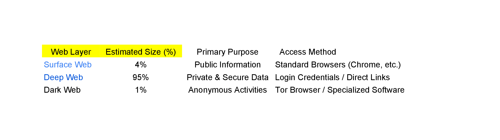

# 
🚀 SEU-CSE1102-S0709

  

---

## 👨‍🏫 Instructors
| Instructor Name | Role | Profile |
| :--- | :--- | :--- |
| **Tashreef Muhammad** | Course Instructor |  |

---

## 👥 Group Members 

<table style="border-collapse: separate; border-spacing: 15px; border: none;">
  <tr>
    <td align="center" style="background: linear-gradient(180deg, #161b22 0%, #0d1117 100%); border: 2px solid #58a6ff; border-radius: 20px; padding: 30px; width: 240px; box-shadow: 0 4px 10px rgba(88, 166, 255, 0.1);">
      

        
      

       
       
      <h3 style="margin: 0; color: #58a6ff;">WALID BIN HOSSAIN</h3>
      <code style="color: #8b949e; background: none;">2026000000203</code>  
      
    </td>
    <td align="center" style="background: linear-gradient(180deg, #161b22 0%, #0d1117 100%); border: 1px solid #30363d; border-radius: 20px; padding: 30px; width: 240px;">
      

        
      

       
       
      <h3 style="margin: 0; color: #3fb950;">ASHIKUZZAMAN</h3>
      <code style="color: #8b949e; background: none;">2026000000191</code>  
      
    </td>
    <td align="center" style="background: linear-gradient(180deg, #161b22 0%, #0d1117 100%); border: 1px solid #30363d; border-radius: 20px; padding: 30px; width: 240px;">
      

        
      

       
       
      <h3 style="margin: 0; color: #f7768e;">MUSTAKIM AHAD</h3>
      <code style="color: #8b949e; background: none;">2026000000181</code>  
      
    </td>
  </tr>
</table>

---
## 📖 Topic Overview
The internet is significantly larger than what the average user encounters daily. This project categorizes the World Wide Web into three distinct layers based on their accessibility and visibility:

* **Surface Web:** This is the top part of the internet that everyone uses. It includes public websites, social media, and news outlets. Despite its high visibility, it represents only about 5% of the total internet.
* **Deep Web:** This is the largest part of the internet. These pages are hidden because they are private. Access usually requires a password or a special link to see them. It is the largest part of the web, private data such as online banking, email accounts, academic databases, and medical records.It is not dangerous, it is just private.
* **Dark Web:** This is a very small part of the internet that is hidden on purpose. cannot open these websites with a normal browser like Chrome.need a special tool called the Tor Browser. People use it to stay 100% anonymous . It is a viral tool for illagle activities like drug sells , gun dealing and data leakage.

---
## ⚙️ Project Workflow
1. Read about the three layers of the web.
2. Collected numbers and data about how big each layer is.
3. Made a chart in Excel to show the difference.
4. Wrote the report and set up this GitHub page.

---

## 🤖 AI Usage Log
| Tool Used | Purpose | Example Prompt (Short) | Output Used | Modification Done | Verification Method | Who Used It |
| :--- | :--- | :--- | :--- | :--- | :--- | :--- |
| ChatGPT | Understanding concept | "Layers of the internet" | Used for explanation | Simplified and rewritten | Checked with Youtube videos | 2026000000203 |
| Gemini | github readme | "get a basic format" | Used in Github | created a reposetory | myself | 2026000000203 |
| claude | understand topic | "Deep Web" | learn for basic and depts | nothing changed | ai | 2026000000191 |

---

### Project Chart

---
## 📊 Spreadsheet Explanation
Our Excel file shows that the Surface Web is very small (only about 4%), while the Deep Web is huge. We used a table to compare the size and security of each layer.

## 🤝 Contribution of Each Member
* **2026000000191:** Responsible for Excel data analysis and chart creation.
* **2026000000181:** Wrote the project report and topic overview.
* **2026000000203:** Set up the GitHub repository and prepared slides.

---

## 📂 Project Structure

<table width="100%">
  <tr style="border: none;">
    <td width="50%" style="vertical-align: top; border: none;">
<pre>
📁 <b><a href="./">SEU-CSE1102-203</a></b>
├── 📁 <b><a href="./slides/main_slides.pptx">SLIDES</a></b>
├── 📁 <b><a href="./reports/research_paper.pdf">research_paper.pdf</a>
├── 📁 <b><a href="./resources/images/">images</a></b>
└── 📁 <b><a href="./resources/excel/">Excel</a></b>
└── 📄 <b><a href="./README.md">README.md</a></b>
      </pre>
    </td>
    <td width="50%" style="vertical-align: top; border: none;">
      <h4>🛠️ Work Pipeline</h4>
      

        ✅ <b>Planning:</b> Completed 
        ✅ <b>Research:</b> In Progress 
        ❌ <b>Final Review:</b> Pending
      

    </td>
  </tr>
</table>

---

  Presentation for <b>Southeast University</b> - Department of CSE  
  @ Group S0709.

  

